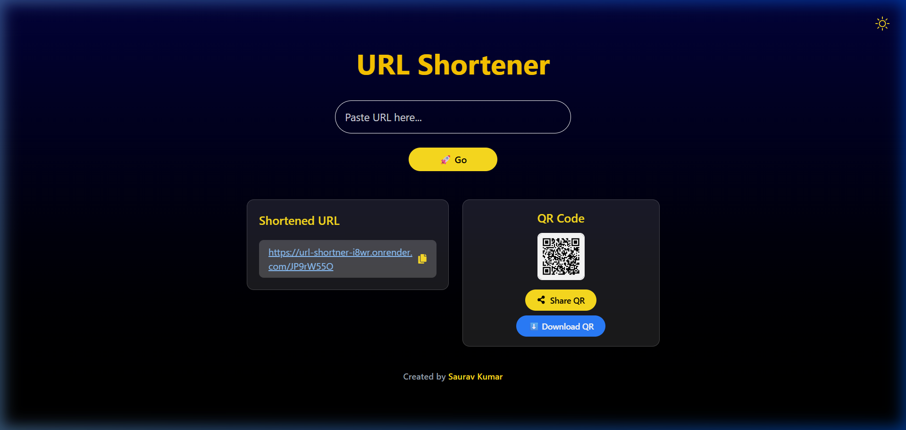

# 🚀 URL Shortener

A modern, fast, and secure URL Shortener application built with **React**, **Node.js**, **Express**, and **MongoDB**. This project features a clean, responsive UI with dark mode support, QR code generation, and easy sharing capabilities.

## ✨ Features

- **Quick Shortening**: Convert long, complex URLs into short, manageable links instantly.
- **QR Code Generation**: Automatically generate a unique QR code for every shortened URL.
- **Easy Sharing**: Copy to clipboard, share via browser API, or download the QR code as a PNG.
- **Dark/Light Mode**: User-friendly interface with sleek animations and theme toggling.
- **Secure Storage**: URLs are securely stored in a MongoDB Atlas cloud database.
- **Visual Feedback**: Micro-animations and toast notifications for a premium user experience.

## 📸 Demo



*Watch the app in action:*


## 🛠️ Tech Stack

- **Frontend**: [React](https://reactjs.org/), [Vite](https://vitejs.dev/), [Tailwind CSS](https://tailwindcss.com/), [Framer Motion](https://www.framer.com/motion/)
- **Backend**: [Node.js](https://nodejs.org/), [Express](https://expressjs.com/)
- **Database**: [MongoDB Atlas](https://www.mongodb.com/cloud/atlas)
- **Deployment**: [Vercel](https://vercel.com/) (Frontend), [Render](https://render.com/) (Backend)

## 🚀 Live Links

- **Frontend**: [https://url-shortner-sigma-lac.vercel.app/](https://url-shortner-sigma-lac.vercel.app/)
- **Backend API**: [https://url-shortner-i8wr.onrender.com](https://url-shortner-i8wr.onrender.com)

## 💻 Local Setup

### Prerequisites

- Node.js installed
- MongoDB connection string (Atlas recommended)

### 1. Clone the repository
```bash
git clone https://github.com/SauravKumar2503/URL_Shortner.git
cd URL_Shortner
```

### 2. Setup Backend
```bash
cd backend
npm install
```
Create a `.env` file in the `backend` folder:
```env
DATABASE_URL=your_mongodb_atlas_connection_string
PORT=3000
```
Run the backend:
```bash
npm run dev
```

### 3. Setup Frontend
```bash
cd ../frontend
npm install
npm run dev
```
Open [http://localhost:5173](http://localhost:5173) in your browser.

## 🛡️ License

Distributed under the ISC License. See `LICENSE` for more information.

---
Created with ❤️ by [Saurav Kumar](https://github.com/SauravKumar2503)
